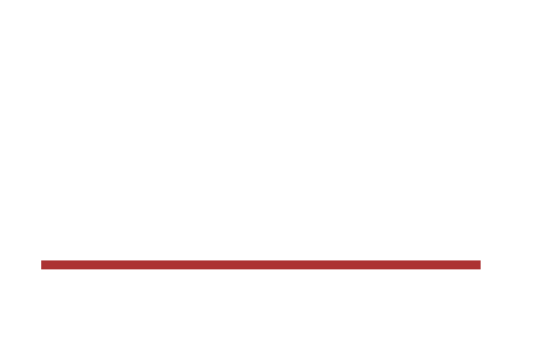

    

---

A simple and easy dotfiles control tool

- TODO:
    - [x] Target System
    - [x] Commands
    - [x] elevate for system dots
    - [x] pyproject.toml
    - [ ] man/help
    - [ ] setup git version
    - [ ] add pyproject version integration with git version

---

- Future Ideas:
    - [x] maybe reimagine syms.json layout, instead of one PER BRANCH, maybe one ber group is more viable, so then each branch only have its instances (0,1,2,...), will lose some power, but maybe its just more simple
          then ONE FOR EACH BRANCH, like, in the ls i can see how this may scale with multiple branches with just (0 > ~/.config/nvim) ...)
    - [x] Group/Branch Dependencie System (command "dep", that u can set the dependencies of an group OR branch (dependencies: file_exists, program_installed, ...)
    - [x] "edit" Command so u can edit a config file from enywhere with your $EDITOR and it auto pushes it after you exit the program (MAYBE a watchdog, but may be overkill, like this program... lol)
    - [ ] "igno" Command to ignore items in folder instance (.gitignore inside folder instances), same vibe as dep but for ignoring things in INSTANCES
